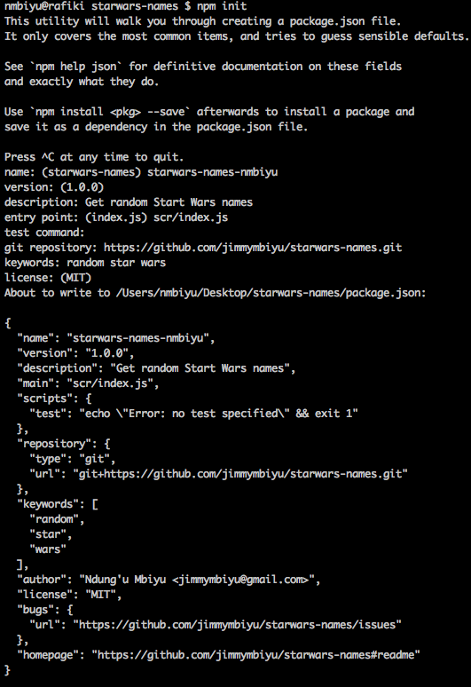

# starwars-names
This project is a library that contains a list of star wars names and allows clients to get the entire list of names of get a random star wars name using a public API.

The library is plublished in npm and this work is a result of following an online course on https://egghead.io/lessons/javascript-how-to-write-a-javascript-library-introduction.

## Installing node
To check if you have it installed, open up a terminal and type `npm -version`. If a version is printed on the terminal, you are all set. If not, visit https://nodejs.org and follow the instructions there to install node.

## Setting up node
https://docs.npmjs.com/misc/config contains details on numerous npm configuration options. As a start, we shall configure a few options.
- https://docs.npmjs.com/misc/config#init-author-name
- https://docs.npmjs.com/misc/config#init-author-email
- https://docs.npmjs.com/misc/config#init-license

To set the properties, open up a terminal and type `npm set {property_name} {property_value}`, e.g 
- `npm set init-author-name "Ndung'u Mbiyu"`
- `npm set init-author-email 'jimmymbiyu@gmail.com'`
- `npm set init-license 'MIT'`

### Semantic versioning
In addition to the properties above, it is also highly recommended that the `save-exact` property, https://docs.npmjs.com/misc/config#save-exact, be set to `true`. 
- `npm set save-exact true`

With this configuration, dependencies saved to package.json using `--save`, `--save-dev` or `--save-optional` will be configured with an exact version rather than using npm's default semver range operator. Using an exact vesion of a dependency protects you as a consumer of libraries incase the authors of those libraries do not use semver properly or there is a mistake made in a release.

Details on semantic versioning can be found here - https://docs.npmjs.com/getting-started/semantic-versioning.

### Configuring npm
Follow the following steps to complete the npm configuration.
- Create an account at http://npmjs.com.
- Open the terminal and type the command `npm adduser`. You shall be prompted for your username, password and email. An auth token and npm rc will be generated.
- Create a `package.json` file by running the command `npm init`. This will walk you through creating the `package.json` file and has sensible defaults.

 
A few terms to note while setting up the `package.json` file are.
- `entry point`: the name that will be used to resolve the module in require statements.
